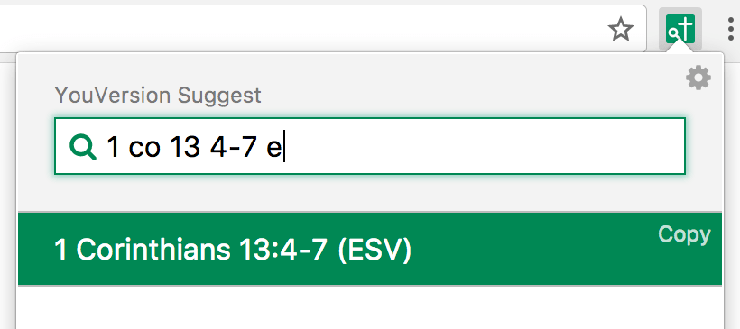
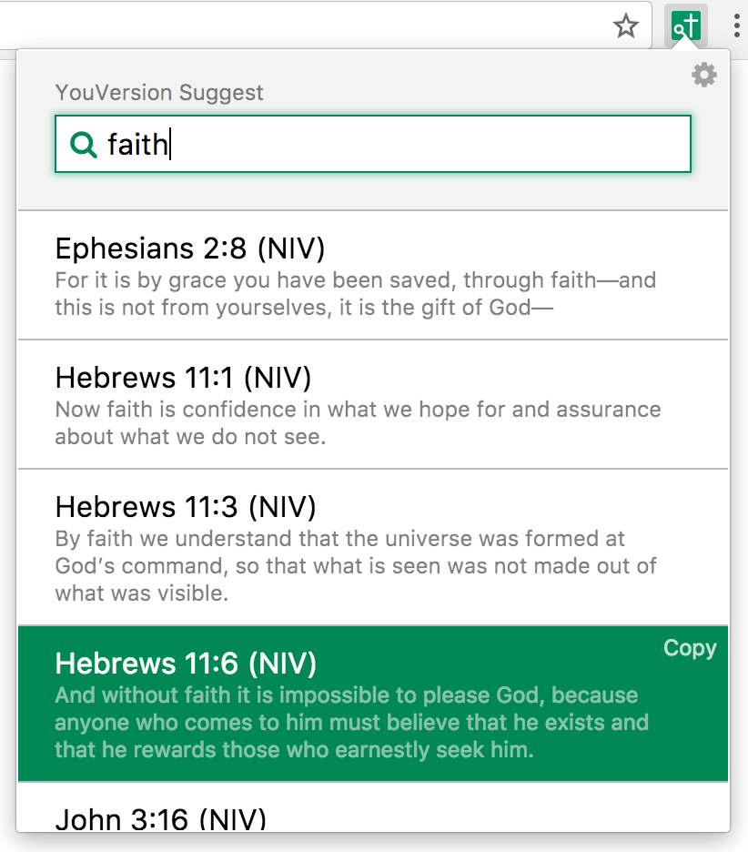

# YouVersion Bible Suggest for Chrome

_Copyright 2017-2024 Caleb Evans_  
_Released under the MIT license_

YouVersion Bible Suggest for Chrome is a Chrome extension that lets you search the
Bible via YouVersion, easily jumping to a particular chapter/verse, or searching
by content keyword.

The project is based on the [Alfred workflow of the same name][yvs].

[yvs]: https://github.com/caleb531/youversion-suggest-alfred

## Features

1. Search by reference (e.g. "without faith")
2. Search by content (e.g. "1 co 13 4-7")
3. Copy content to clipboard (via the _Copy_ link next to each result)
4. Over 20 languages and 200 versions/translations supported
   (see the Preferences page for a full list)




## Development Setup

### 1. Install local dependencies

```
npm install -g grunt
npm install
```

### 2. Download Bible data

```
git submodule update --init --recursive
```

### 3. Build extension

```
grunt serve
```

### 4. Load into Chrome

1. Click the **Window** menu and choose **Extensions**
2. Check the **Developer Mode** checkbox at the top of the page
3. Click the **Load unpacked extension...** button to the left
4. Choose your local project's `dist/` directory from the navigator prompt

## Disclaimer

This project is not affiliated with YouVersion, and all Bible content is
copyright of the respective publishers.
