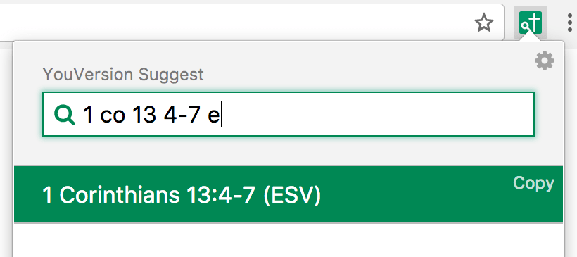
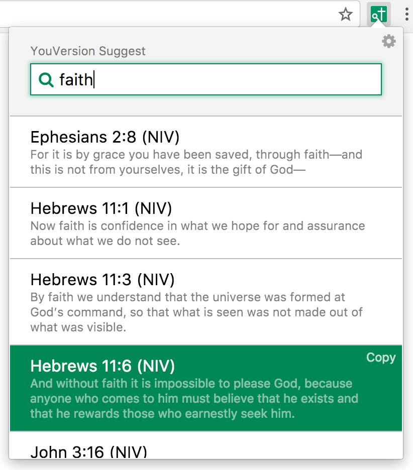

# YouVersion Bible Suggest for Chrome

_Copyright 2017-2024 Caleb Evans_  
_Released under the MIT license_

YouVersion Bible Suggest for Chrome is a Chrome extension that lets you search
the Bible via YouVersion, easily jumping to a particular chapter/verse, or
searching by phrase.

## Disclaimer

This project is not affiliated with YouVersion, and all Bible content is
copyright of the respective publishers.

This tool also retrieves Bible content directly from YouVersion for personal
use. However, please be aware that this functionality does not fully comply with
YouVersion's Terms of Use.

## Features

1. Search by name (e.g. "1 co 13 4-7")
2. Search by phrase (e.g. "without faith")
3. Copy content to clipboard (via the _Copy_ link next to each result)
4. Over 20 languages and 200 versions/translations supported
   (see the Settings page for a full list)

# Installation

1. Download the ZIP file from [the latest GitHub release][release]; unzip it
   after downloading
2. Click the three-dot icon to the right of Chrome, and choose **Extensions**
   from the menu
3. Check the **Developer Mode** checkbox at the top-right of the page that opens
4. Click the **Load unpacked extension...** button that appears in the top-left
   corner
5. Navigate to the unzipped folder you downloaded and choose it

Now, you will see the YouVersion Bible Suggest extension icon under the
extensions menu, which you can access via the puzzle piece icon in the top-right
of Chrome.

[release]: https://github.com/caleb531/youversion-suggest-chrome/releases/latest
